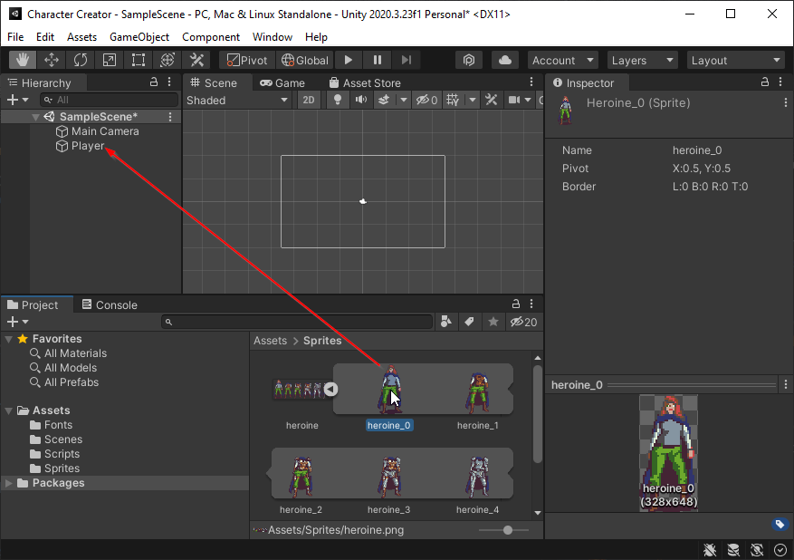

# Milestone 1: Adding a Player Object

In this milestone, you will:

* Import the project assets
* Slice your sprites
* Add a Player object to the scene
* Add a Player Sprite to the scene
* Add an Armor Sprite to the scene
* Add a Weapon Sprite to the scene

## Importing Assets

Before starting, let's add all of the assets required for the project.

1. Download the assets archive: [Milestone 1
   Assets.zip](Milestone%201%20Assets.zip)
2. Open the archive
3. Inside there are 3 files
   *  `advanced_pixel-7.ttf` - This is the font we will use
   *  `heroine.png` - This is a sprite sheet containing the player and armor
      graphics
   *  `weapons.png` - This is a sprite sheet containing the weapon graphics
4. Import these into your `Assets` folder by dragging them into `Assets` section
   of Unity.

It is good practice to organize your files so they don't get cluttered. On a
small project, it isn't as big of a problem but it is a good habit to have.

5. Create a folder in your `Assets` folder called `Fonts`
6. Move the font to the `Fonts` folder
7. Create a folder in your `Assets` folder called `Sprites`
8. Move your image files to the `Sprites` folder
9. Create a folder called `Scripts`
10. Move your `PlayerController` script into the `Scripts` folder.

When you're finished, your `Project` tab should look similar to this:

## Slicing a Sprite

The `heroine.png` file is a single file that looks like this:

This image contains several "sub" images. In video games, this is often referred
to as a `Sprite Sheet`. In video games, a `Sprite` is a single image and a
`Sprite Sheet` is an image containing several `Sprite`s. This is done to save
space and reduce the size of a program. 

Unity provides a tool for "Slicing" sprite sheets into individual sprites. Let's do this with the `heroine.png` file.

1. In the `Project` tab, navigate to your `heroine` sprite and select it. 
   
This will open the file in the inspector.

2. Set the `Texture Type` to `Sprite (2D and UI)`

    This setting tells Unity this image file should be treated as a Sprite.

3. Set the `Sprite Mode` to `Multiple`

    This settings tells unity this is a sprite sheet.

4. Set the `Filter Mode` to `Point (no filter)`
5. Set the `Compression` to `None`

    For this project, we are using Pixel Art so we want to turn off these settings to make sure Unity doesn't try to smooth the graphics when the screen is large.

6. Click Apply

Next, click the `Sprite Editor` button in the inspector.

This will open a window that will allow you to slice the sprite.

7. Click the `Slice` option in the `Sprite Editor`
8. Under `Type` select `Grid By Cell Count`

This option is used for images that have evenly spaced sprites.

9. Specify that there are `6` columns and `1` row
10. Click Slice

If all went well, each of the individual images within the sprite sheet should have borders indicating how they were sliced.

11. Click Apply
12. Close the `Sprite Editor`

Back in the `Assets` folder, you should now be able to click the arrow next to the `heroine` sprite sheet and it will show all of the sprites contained within.

### Challenge: Slice the Weapons Sprite Sheet

** Using what you've learned, slice the `weapons` sprite sheet.

When you're finished: 
 * Save your project. 
 * Commit and push your work.
 * Create a tag `challenge-weapons`
 * Push your tag

## Adding a Player Object to the Scene

Next, let's add a Game Object to our Scene to represent the Player.

1. Right click in the hierarchy
2. Select `Create Empty`
3. Rename the object `Player`
4. Ensure that the `Player` is at position (0,0,0)

Next, let's add the base player graphic to our `Player` game object. 

5. Drag the `heroine_0` sprite into the hierarchy on top of the `Player` object you created.

6. Rename the added game object `Base Image`
7. Ensure that the `Base Image` is at position (0,0,0)

Next, let's add a weapon layer to the `Player` object.

8. Drag the `weapons_0` sprite onto the `Player` object in the hierarchy.

You'll notice that the added sprite may be rendered beneath the base image. To fix this, we need to adjust the `Order in Layer` setting of the `Sprite Renderer`

9. Rename the added game object `Weapon`
10. Change the `Order in Layer` under `Sprite Renderer` to 1

This should make the `Weapon` object appear above the `Base Image` object.

11. Adjust the position of the `Weapon` object to (0.525, -0.75, 0)

This will position the weapon so it looks like the character is holding it.

Now that the `Weapon` object is in the correct position, you can swap out the `Sprite` inside of the `Sprite Rendere` and the player will swap which weapon they are holding.

12. Swap out the weapon sprite

### Challenge: Add an Armor Game Object

Using what you learned in this section, add an `Armor` Game Object to your `Player` object that uses the `heroine` sprites to swap out the armor the player is wearing.

When you're finished, your scene should look similar to this:

After you have completed this, you are finished with Milestone 1.

* Save and commit all of your work
* Push your work
* Add a `milestone-1` tag
* Push your tag

