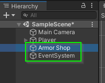

# Milestone 2: Adding a Weapon Shop

In this milestone, you will:

* Attach the `PlayerController` Script to the `Player` Game Object
* Write a `SetWeapon(Sprite)` method in the `PlayerController`
* Add a `Canvas` to the scene for your `Weapon Shop`
* Add a `Button` to the `Weapon Shop` 
* Attach the `OnClick` method to your `PlayerController`'s `SetWeapon` method

## Attaching the PlayerController Script

Before we can control the state of our Scene, we need to add a script to one of
the Game Objects within it. Let's add the `PlayerController` script to our
`Player` Game Object.

1. Select the `Player` Game Object
2. In the `Inspector` click `Add Component`
3. Search for `PlayerController` an select it.

If the `PlayerController` script does not appear, there are a few reasons this
might be the case:

    * Check that you have a `PlayerController` script in your `Scripts` folder. If not, you will need to create one.

    * If you have a `PlayerController` script and it is still not appearing. Double check that both the filename and the class name are `PlayerController`.

## Adding a SpriteRenderer to the PlayerController Script

We now have a `PlayerController` script attached to the `Player` Game Object.
Next, we need to create a `public` member variable so we can attach the `Armor`
Game Object to our script.

1. Open the `PlayerController` script by double clicking on it in Unity.
2. Ensure that VS Code is communicating with Unity by typing `UnityEngine.U` and
   waiting to see if it autocompletes to `UnityEngine.UI`. After you've verified
   that this autocompletes, you can delete this line.

If autocomplete does not show up, you should completely exit VS Code (right
click in the task bar and then reopen from Unity). Sometimes, if you open
another VS Code project (e.g. your Student Log), VS Code will stop talking with
Unity.

3. Next, we are going to create a `public` member variable for a
   `SpriteRenderer`. This member variable will be a reference to our `Armor`
   Game Object so let's call it `ArmorRenderer`.

4. Save your file and return to Unity.

## Attaching the Armor Game Object to the PlayerController

Before we can start using the `ArmorRenderer` member variable in our
`PlayerController` we must first specify what it references in our scene.

1. In Unity, select the `Player` object.
2. In the `Inspector` you should now see the `Armor Renderer` member variable as
   part of the `Player Controller`.

If you do not see it, this could mean a few things. Here are two reasons why it
might not appear:

* You may have a compilation error. One of the errors will usually be displayed
  in the bottom of the Unity editor. You can see all compilation errors by
  clicking on the `Console` tab.

* You may not have set your variable to `public`. If your set your variable to
  `private`, `protected`, or you don't specify `public`, it will not appear in
  the Unity Editor

3. Notice, the `Armor Renderer` variable is set to `None`. 

This is because we have not attached any elements from our Scene to it yet. When
you attach an element form your scene to a member variable of a script, it is
the same as using the assignment operator (`=`) in code. The object that is
being assigned is called a "Reference". This is because the member variable is
"referencing" that object.

4. Assign the `Armor Renderer` member variable to reference the `Armor` Game
   Object.

   * You can drag the `Armor` Game Object from the hierarchy into the space.
   * You can click the small circle icon next to the space and find the object
     in the scene. (This has the advantage of having a search option).

5. Save your Scene

## Writing a SetArmor(Sprite) method

Now that our script has a reference to the `Armor` Game Object in the scene, we
need to write code that will change the Sprite that is being displayed.

1. Open the PlayerController script
2. Add a `public` method called `SetArmor` which takes a `Sprite` as a parameter
   and returns `void`.

3. Finally, we need to update `ArmorRenderer.sprite` to be the `newSprite`.

4. Save your work.

## Adding a Button to Set the Armor

We are finally ready to connect everything together and make a button that will
call the `SetArmor` method to update the `Armor` Game Object's `Sprite
Renderer`.

### Create a Canvas for the Button

1. Open Unity
2. In the hierarchy, add a `UI` > `Cavas`

Note: When you add a `Canvas` for the first time it will also add an
`EventSystem`. You don't need to do anything with this element. Just know that
it controls how user interactions with buttons and other elements are handled.

3. Rename the `Canvas` to be `Armor Shop`

By default, the Canvas' `Render Mode` is set to `Screen Space - Overlay`.

This option is a little tricky to use and isn't necessary in a game that only
uses one camera. To simplify the process, we are going to use `Screen Space -
Camera` mode.

4. Update the `Render Mode` of your `Armor Shop` to be `Screen Space - Camera`

This option sets the Canvas to be drawn on a specific camera. You will notice a
warning saying, `A Screen Space Canvas with no specified camera acts like an
Overlay Canvas`. To resolve this, we must set the `Render Camera` for our `Armor
Shop`.

5. Set the `Render Camera` field to user the scene's `Main Camera`.

This can be done by dragging the `Main Camera` from the hierarchy or by clicking
the circle next to the field and selecting it from the scene.

### Adding a Button to the Canvas

Next, let's add a Button to the Canvas.

1. Right click on the `Armor Shop`
2. Select `UI` > `Button`

This will add a `Button` Game Object to the Scene. However, it probably appeared
**behind** your `Player` Game Object. This is because, by default, a newly added
`Canvas` will have its `Order in Layer` set to `0`.

To fix this, we can adjust the `Armor Shop`'s `Canvas` component to be drawn at
a higher layer. If you want everything in your `Canvas` to be drawn on top of
everything else, you can set this value to something like `1000`. 

3. Update the `Armor Shop` to be drawn above everything else.

### Repositioning the Button Relative to the Screen Size

Historically, creating a good user interface has been the bane of programmer's
existence. This has not changed. In fact, this has become more difficult
overtime as the number of different screen types has increased. Every mobile
device has a different screen size. Monitors have different screen sizes. Some
applications are made for the web which can be **ANY** size. As a programmer, it
is almost impossible to account for every possible display.  If you ever see a
user interface that looks and feels great, take a moment to truly appreciate the
programmer who created it.

Next, we will try to understand a little bit about how Unity positions elements
on a Canvas and some of the features it provides to **ATTEMPT** to make this easier.

1. Select the `Button` Game Object you created

In the `Inspector`, you will find a `Rect Transform` component attached to the `Button`. 

This is component controls how the element is rendered inside of it's parent element (in this case `Armor Shop`). By default, a new `Button` element is set to be in the center of its parent element, have a width
of 160 and a height of 30. If you adjust the `Pos X` and `Pos Y` values, the `Button` will reposition itself within the `Armor Shop` canvas relative to the center.

This is useful if you want your interface to be in the middle of the screen. However, if you want your elements to appear at the top of the screen, this is not useful unless you know how tall the screen will be. Unfortunately, in the modern age of computer displays, this just isn't an option. 

To account for this, Unity's `Rect Transform` component allows us to specify what part of the screen we would like to position ourselves relative to. You can specify this by clicking the "Target" icon in the top left of the `Rect Transform` element.

2. Click the "Target" icon of the `Rect Tranfrom` element
3. Set the relative position to be `Top Left`

Notice, after making this selection, your `Button` object doesn't actually move. Instead, it will automatically update it's `Pos X` and `Pos Y` values to be "correct" for its current screen position on **your** screen size. If you start the project by clicking the play button, and adjust the size of the screen, you can watch the button move around and stay at this position relative to the top left corner.

