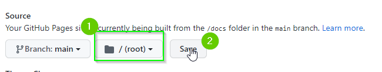
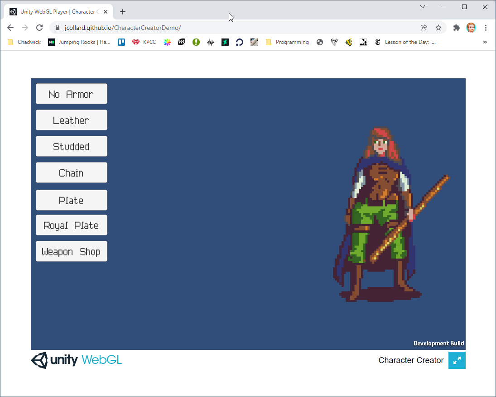

# Milestone 3: Building and Publishing Your Project

In this milestone, you will:

* Learn how to build a Unity Project
* Learn how to change the type of Build for a Unity Project
* Compile a WebGL project
* Configure a GitHub pages repository
* Deploy a WebGL project to GitHub

- [Milestone 3: Building and Publishing Your Project](#milestone-3-building-and-publishing-your-project)
  - [The Basics of Building](#the-basics-of-building)
  - [Building a WebGL Project](#building-a-webgl-project)
  - [Creating a Web Page on GitHub](#creating-a-web-page-on-github)
    - [Changing WebGL Settings](#changing-webgl-settings)
    - [Creating a GitHub Page](#creating-a-github-page)
    - [Adding your Project to the Repository and Publishing](#adding-your-project-to-the-repository-and-publishing)
    - [Checking the status of your Deployment](#checking-the-status-of-your-deployment)
  - [Turning in Milestone 3](#turning-in-milestone-3)

## The Basics of Building

Alright! You have something you want to share with other people (maybe). As it
is right now, the other person would need Unity installed. They would need to
clone your repository. Add the project to their Unity Hub. Load it up. And then
click Run... what a pain.

When you're ready to turn your project into a distributable program, we do what
is called a "build". This is a process in which we put all the necessary
components required to run a project together and (hopefully) ignore everything
else. For different platforms (e.g. Windows vs Mac) you need different files to
be able to run the project. Luckily, Unity tries to automagically complete this
process for us. Though... it is a bit finicky.

1. Open your project in Unity.
2. From the top menu, select `File` > `Build Settings`

This should open up the `Build Settings` screen. By default, projects in Unity
are configured to build for the platform you are currently on. For most of you,
it will be "Mac". Let's see what happens when you build.

3. Click the `Build` button. (More instructions after image)

This will open up a dialog window that will ask you where to place the build on
your computer. **DO NOT** put it in your repository. It will take up a lot of
space and make your push / pulls take a very long time. (On future projects, I
will show you how to add your builds to your `.gitignore` file so you can add it
here).

I recommend creating a New Folder in your Documents folder called "Unity Builds"
so it will be easier to fine.

4. Choose where you would like to build your project.
5. Give your project a name (this will be the name of the file that is created)
6. Click Save

After several moments...

A new window will open with a file that has the name you specified. You can run
the project by double clicking it.

**BEFORE RUNNING**: The project will start in full screen mode. We have not
created a way to exit the program. To exit, you will need to move the cursor to
the top of the screen and select the close button from the window.

**Note**: On Windows, this will create an entire folder with several files. You
can run the project by clicking on the executable.

Cool! If you want, you can send this file to anyone who has the same platform as
you and they can run it.

## Building a WebGL Project

Unity has a really cool features that allows you to build your project to be run
in a web browser using something called "WebGL" and "Web Assembly". You don't
need to worry about what this means, just know that it is really cool and is
relatively new.

To do this:
1. Open your `Build Settings` options in Unity.

On the left side of the window, you probably already noticed there are several
different platforms that you can target for your build. We are going to use
WebGL.

2. Click `WebGL` on the left
3. Click the `Switch Platform` button

It may take awhile to switch.

**Note:** It is possible that something went wrong while you were installing
Unity and it may tell you that you have to install WebGL support. If this is the
case, go through the on screen instructions. Unfortunately, I wasn't able to get
screenshots of this process but I believe in you!

After a moment, the platform will switch. Now, you can build your project for
the web.

For good reasons that we won't go into on this project, you cannot run projects
built with WebGL directly on your computer -- they need to be uploaded to the
internet. However, Unity provides a `Build and Run` feature that will start a
small Web Server on your computer to test a WebGL build. To do this, click the
`Build and Run` button.

1. Click `Build and Run`

The first time you build a WebGL project (and sometimes after you've made
significant changes) it will take a **very** long time to build... several
minutes. You just have to wait while this compilation process occurs.

Eventually, the build process will finish and Unity will open your project in
your web browser.

## Creating a Web Page on GitHub

Sweet! We have a WebGL version of our project. Next, we need to publish it to
the internet. GitHub allows you to turn any repository into a Web Page that can
host your project. However, this requires your WebGL project to be compiled with
slightly modified settings.

### Changing WebGL Settings

1. Open the `Build Settings` page
2. Click the `Player Settings` button in the bottom left.

This should open up the `Player Settings` screen.

On this page you can set many different values to configure your user
experience. For your project to run on GitHub, the only necessary setting to
change is to disable compression.

3. Ensure you're on the WebGL Tab
4. Find the `Publishing Settings` section
5. Disable Compression

Once this is selected, you can close this window.

6. Finally, click Build (you don't need to click `Build and Run` this time
   unless you want to see what it looks like again).

While it is building, you can continue to the next section.

### Creating a GitHub Page

Next, let's create a GitHub Repository that you will turn into a web page to
share your project.

1. Go to GitHub.com
2. Log in to your account
3. Click the `+` icon in the top right corner
4. Click `New Repository`
5. Give your repository a name, I recommend "Character Creator Demo"
6. Make sure your repository is set to be `Public`. If you set it to private,
   you cannot make it a web page
7. Click the `Add README.md` check box
8. For this project, you do not need a `.gitignore` file.
9. Click `Create repository` 

After a moment your repository will be created.

10. Select the `Settings` tab.

11. On the left side find the `Pages` option.

12. Next, set the `source` of the page to be the `main` branch of your
    repository.

13. Leave the `(root)` option as the default location and click `Save`

If all went well, you will receive a message with a URL where your repository
can be accessed as a Web Page. If you click this link, it will display the
contents of your projects `README.md` file.

### Adding your Project to the Repository and Publishing

Now that you have a Web Page for your project, you need to add your WebGL build
to the web page.

1. Start by cloning your project with `GitHub Desktop` through the usual means
2. Next, you need to find your repository in the file browser (`Finder` on Mac
   and `Explorer` on Windows).
3. Next, you need to delete your `README.md` file. We will be replacing it with
   your project.
4. Open a second file browser and find your WebGL Build

The WebGL Build should be a folder containing a file called `index.html` as well
as a two folders, `Build` and `TemplateData`:

5. Copy all of these files directly into your repository folder
6. Return to GitHub Desktop and commit your changes

There should be 15 - 30 changes. Your commit message should be something similar
to "chore: Build and deploy project".

7. Finally, push your changes to GitHub.

### Checking the status of your Deployment

After you have pushed your changes, you can view the status of your projects
deployment on your GitHub Repository page.

1. Open your Repository on GitHub

On the repository page, you will see a small icon next to your most recent
commit which will change depending on the deployment status. Your deployment is
quite small so you may already be a green check mark by the time you visit the
repository page. When you get the green check mark, it means you can visit your
projects URL and view your project deployed online.

2. Go to your `Settings` > `Page` on your repository
3. Find your Page's URL and click on it.

That's it! You've successfully deployed your project. Great job!

## Turning in Milestone 3

There was no code / project updating during this milestone. To turn in this
milestone, send Mx. Collard an email with a link to your deployed project.
