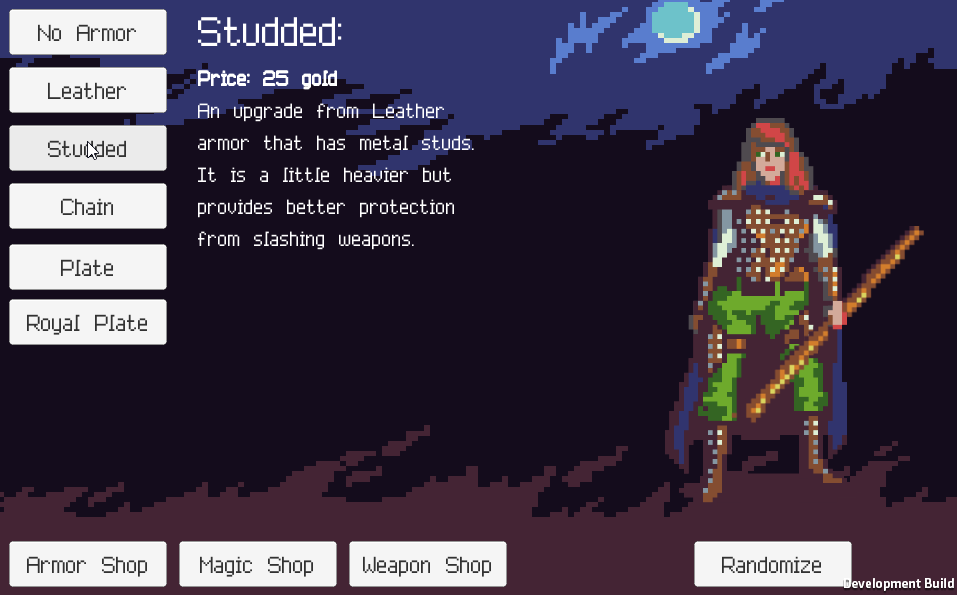

# Advanced Features

Alright! You've finished the basic portion of the project. Next, you must
customize your project adding additional features to enhance your project. These
could be just about anything BUT you must get them approved first. If you only
choose easy features, you will need to add more of them.

For example, I might approve:

* 3 easy features
* 1 medium feature and 1 easy feature
* 1 hard feature

When you have finished, you should save, build, and publish your changes to your project repository page. Then, add a tag `advanced-features` and push.

Here are some pre approved ideas:

- [Advanced Features](#advanced-features)
  - [Demo Features](#demo-features)
  - [Add Background Music (Easy Feature)](#add-background-music-easy-feature)
  - [Add Sound Effects (Easy Feature)](#add-sound-effects-easy-feature)
  - [Add a Text information about items (Medium Feature)](#add-a-text-information-about-items-medium-feature)
  - [Add a "Magic Shop" using Particle Effects (Medium Feature)](#add-a-magic-shop-using-particle-effects-medium-feature)
  - [Character Randomizer (Hard Feature)](#character-randomizer-hard-feature)
  - [Make a second Project (Medium / Hard Feature)](#make-a-second-project-medium--hard-feature)
    - [Some resources that you could use (All from OpenGameArt.org)](#some-resources-that-you-could-use-all-from-opengameartorg)
    - [Monster Selector (Medium / Hard Feature)](#monster-selector-medium--hard-feature)

## Demo Features

Click the image below to open an example project demonstrating some features you could add.

## Add Background Music (Easy Feature)

Research and add background that changes depending on if your `Armor Shop` or
`Weapon Shop` is open.

## Add Sound Effects (Easy Feature)

Find several sound effects that can be played when a Weapon or Armor item is
selected. For example, each weapon could have a different sound: 

* The stick makes a "thud" sound
* The sword makes a "schwing" sound
* The Chain armor makes a "chunk" sound

Two great sites to find resources that you can use:

* OpenGameArt.org: [LINK](https://opengameart.org/)
* FreeSound.org (free sign-up required to download): [LINK](http://www.freesound.org/)

## Add a Text information about items (Medium Feature)

Add text elements to your scene to display the name, description, and price of
each item.

* Create a new Canvas for your text elements (they shouldn't disappear when you
  switch shops)
* Add 3 text elements to the new canvas
* Position them in a "pleasing" way on the screen.
* Write a `SetName(string)`, a `SetDescription(string)`, and a
  `SetPrice(string)` method to your `PlayerController`
* Add the appropriate Event Listeners to each buttons `OnClick` event.
* When you're finished, publish your project to a GitHub Page repository

Demo of a project with this feature: [LINK](https://jcollard.github.io/CharacterCreatorDemo/)

## Add a "Magic Shop" using Particle Effects (Medium Feature)

Research how to use the `Particle Effect` system built into Unity to make a
"Magic Shop".

* Add a `Magic` Game Object to your `Player` Game Object
* Inside of the `Magic` Game Object, add an `Effects` > `Particle System`
* Rename the `Particle System` something like "Blue Magic"
* Play with the Particle System features in the `Inspector`
* Make several (at least 3) different "Magic" options
* Create a Magic Shop canvas with buttons which call the `SetActive` option
  appropriately for each of your "Magic" effects.

Demo of a project with this feature: [LINK](https://jcollard.github.io/CharacterCreatorDemo/)

## Character Randomizer (Hard Feature)

Research how to use the `Random` class to generate random numbers. Then, using
the randomly generated number, call a specific buttons `OnClick` method.

* Create a `public List<UnityEngine.UI.Button> WeaponButtons;` in your
  `PlayerController`
* Write a method `public void SetRandomWeapon()`
* Use the `Random` class to generate a number between `0` and
  `WeaponButtons.Count`.
* Select the button from the list using generated number (e.g.
  `WeaponButtons[0]`)
* Call the button's `onClick.Invoke()` method (e.g.
  `WeaponButtons.[0].onClick.Invoke()`)
* Create a new button in your `Weapon Shop` called `Random Weapon`
* Update the `Random Weapon` button to call `SetRandomWeapon()`
* Repeat the above steps for `Armor`
* Bonus: Add a `Random Character` button that calls both methods.

## Make a second Project (Medium / Hard Feature)

Use everything you've learned thus far to create a completely new project that
utilizes images, text, and buttons.

You should:

* Create a new repository on Git and invite Mx. Collard
* Make sure to add a Unity `.gitignore`
* Create a new 2D (or if you're brave 3D) Unity Project
* Find graphics on the internet and add them to your project
* Add buttons to switch elements on the screen
* Add Text on the screen and use a custom font

### Some resources that you could use (All from OpenGameArt.org)

* Pixel Art Food Builder Icons: [LINK](https://opengameart.org/content/lpc-meals)
* Adventure Game Equipment Sprites: [LINK](https://opengameart.org/content/armor-icons-by-equipment-slot)
* Fantasy Icons: [LINK](https://opengameart.org/content/fantasy-icon-pack-by-ravenmore-0)
* Parallax Background: [LINK](https://opengameart.org/content/pixel-art-parallax-background)
* Underground Background: [LINK](https://opengameart.org/content/underground-sidescroller-background)
* Space Background: [LINK](https://opengameart.org/content/space-background-3)

### Monster Selector (Medium / Hard Feature)

The sprites you're using for this project come from a game that has additional
assets. Make a second project using those assets. A "Monster Selector" would be
great! But, you can suggest another project of your own design.

Enemies: [LINK](Files/enemies.zip)

The idea here is to use the enemy images to create a project similar to this one
which shows the enemy image and displays a little information about them.