# Character Creator

For this project, you will create a basic Character Creation tool where a player
can select the weapon and armor their character is using.

## Create a new Repository

First, you will create a new repository from scratch.

1. Go to GitHub.com
2. Login
3. In the top right corner, click the `+` icon.
4. Select `New Repository`

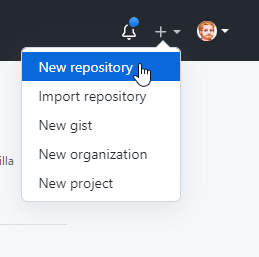

5. Set the name of your repository to `CharacterCreator`
6. Select `public` or `private`. If you select `public` the repository will be
   accessible by anyone in the world.
7. Check that you want to create a `README` file
8. Check `Add .gitignore`
9. Select `Unity` as the `.gitignore template`
10. Click `Create repository`

## Add Mx. Collard as a Collaborator

Next you will add Mx. Collard as a collaborator.

1. On your Repository Page, select the `Settings` tab.

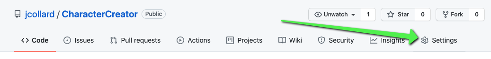

2. On the left, click `Manage Access`
3. On the manage access page, select `Add People`
4. Search for `jcollard` and add them as a collaborator

## Clone your Repository

Next you will clone your repository.

1. Open GitHub Desktop
2. Select `Add` > `Clone Repository`

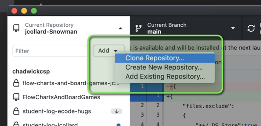

3. Find your Repository
4. Take note of the path. This is where the Repository will be cloned on your
   computer.
5. Click Clone

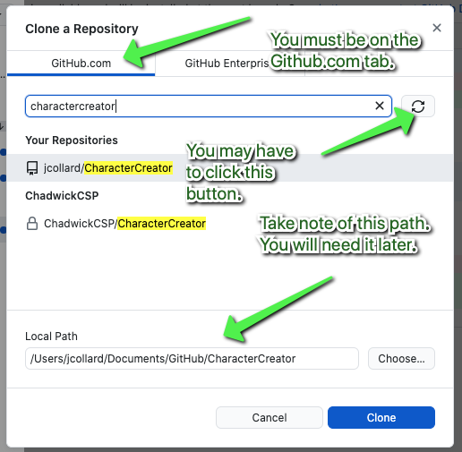

## Create a Unity Project

Next, you will create a new Unity Project.

1. Open Unity Hub
2. Click the `Projects` Tab
3. Click the `New` button in the top right.

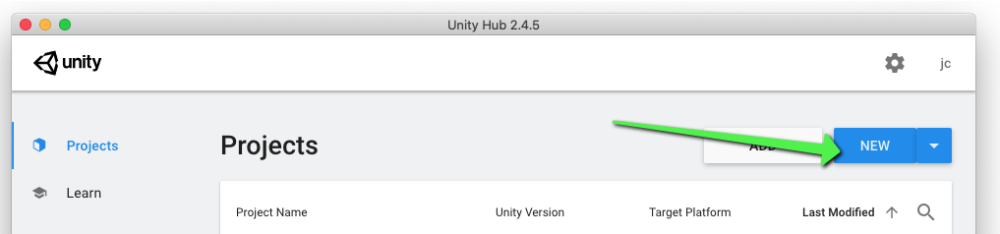

4. Set the project to be a `2D` project
5. Set the name of the project to be `Character Creator`
6. Click the three dots and find your repository location.
7. Click Create

It may take awhile for the project to be initialized. Be patient, it will
eventually finish.

When it finishes, it should open up a new scene. The screenshot below is in
"Light Mode" yours may be in dark mode.

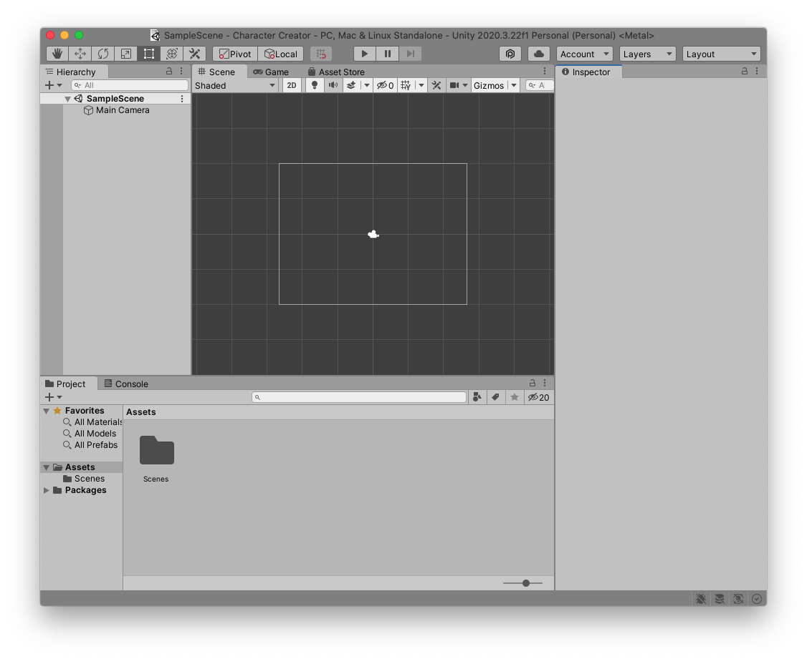

## Moving `.gitignore`

Next, we must move the `.gitignore` file that GitHub created into your projects
folder.

1. Open VS Code
2. Select `File` > `New Window`

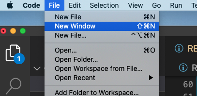

3. Select `File` > `Open Folder`
   * Some versions do not have `Open Folder` in this case, just click `Open`

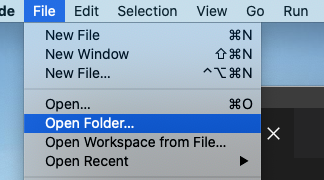

4. Navigate to your repository location. It should look like this:

5. Click Open

6. Move the `.gitignore` file into the project folder.

7. Completely exit VS Code by right clicking on the icon in the task bar and
   selecting `Quit`

## Configuring VS Code and Unity Project

Next, we will open the Unity Project in VS Code. When you start a new project,
it is good practice to follow these steps. It isn't always necessary. BUT
sometimes a project gets out of sync. 

1. Return to `Unity`
2. From the top menu select `Unity` > `Preference`
   * On Windows this is in `Edit` > `Preference` 

3. On the left, click `External Tools`
4. Ensure that the default editor is set to `Visual Studio Code`
5. Click, `Regenerate Project Files`

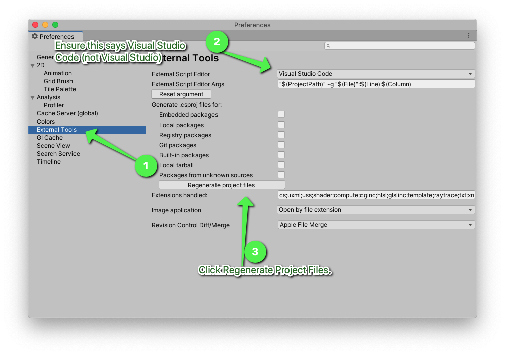

6. Close the Preferences Window

## Opening VS Code from Unity

Whenever you are working on a project in Unity, you need to make sure you open
VS Code from Unity to have it load properly. First, ensure that VS Code is
completely closed. Then, double click a script in the Assets section to launch
it.

Since this is a new project, let's create a new script:

1. Right click in the `Assets` folder
2. Select `Create` > `New C# Script`
3. Name the script `PlayerController`
   * It is important to name it exactly `PlayerController` with a capital `P`,
     `C`, and no spaces

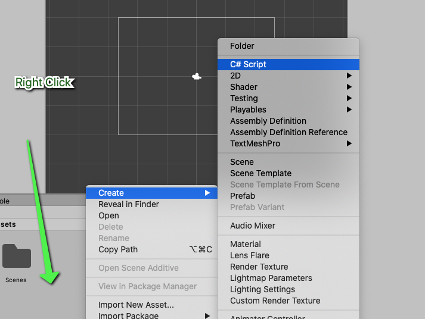

4. Double click the script to open it.

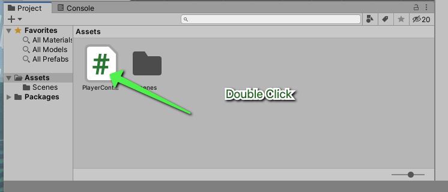

Ensure that your VS Code matches the screenshot below.

* Your file name should be `PlayerController.cs`
* The name of the class should be `PlayerController`
* The Source Control button should report around 30 changes
* You **may** receive an error about the project not loading properly

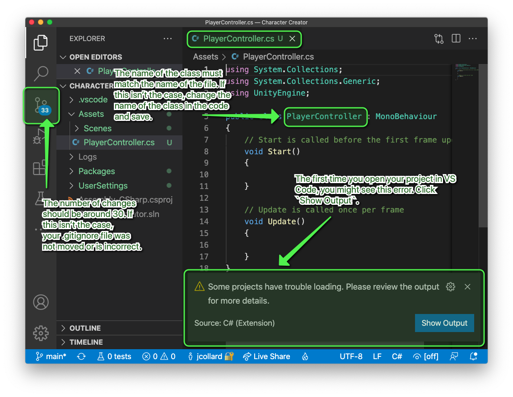

## How to Fix OmniSharp

If your project is saying that it cannot load properly, it is likely that
`OmniSharp` is not talking to `Mono` properly.

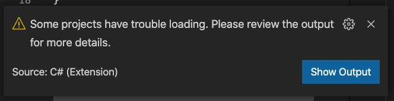

1. To verify this, click the `Show Output` button.
    * Alternatively you can open the command pallet (`Command + Shift + P`) and
      select `Focus on Output View`

2. On the `Output` tab, select `Omnisharp Log`. 
3. Look an error in the output tab that says something similar to `e.g.
   "omnisharp.useGlobalMono":"always" in C# Extension for VS Code`

If you see this error, this means that VS Code is not talking to `mono`
properly. Here is how to fix this:

1. Open the command pallet `Command + Shift + P`
2. Search for `Open Workspace Settings`
   * Do not open `User Settings` or `Workspace Settings (JSON) 

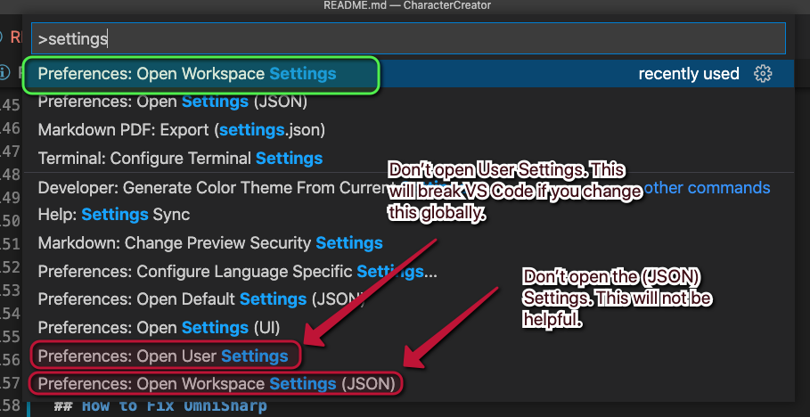

3. On the Setting screen, ensure you're on the Workspace tab
4. Search for `mono`
5. Find the `C# Extension` menu
6. Set the option `Omnisharp: Use Global Mono` to `always`
7. Completely quit VS Code from the task bar.

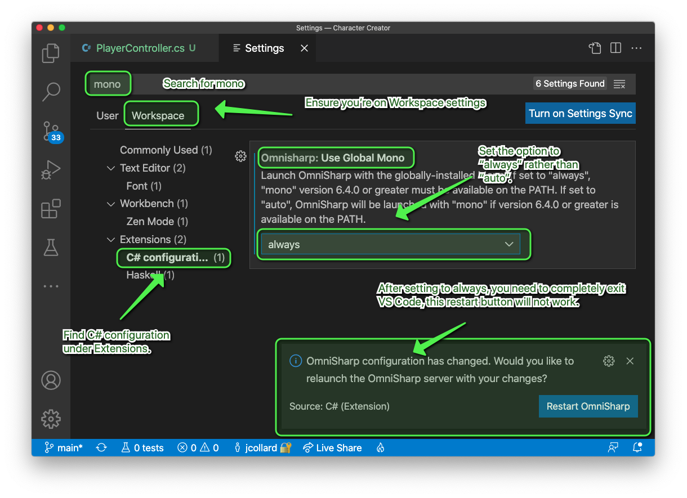

8. Reopen your project from Unity by double clicking the script.
9. Open your Output tab and select `Omnisharp Log`

If you receive an error saying that `Mono's /bin folder` cannot be found. It
usually means that you did not completely exit VS Code.

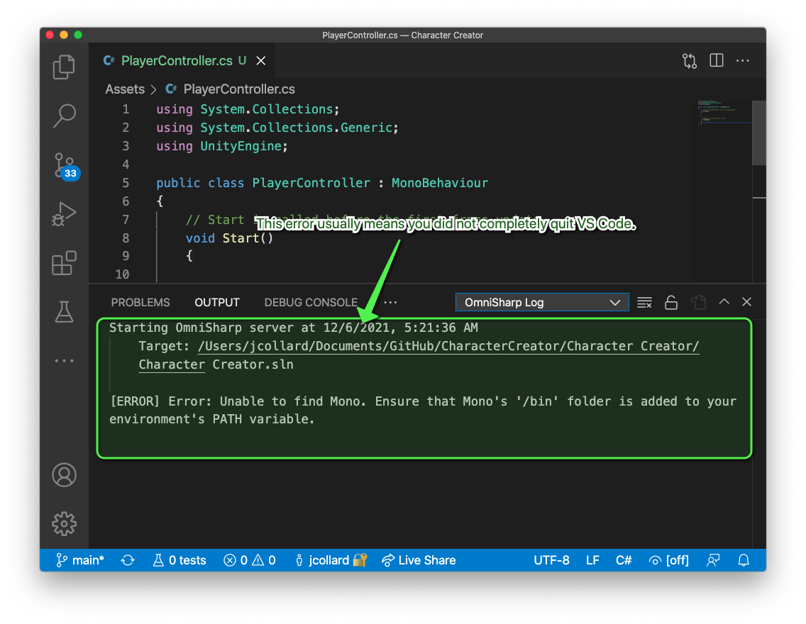

If all went well, your output should look something like this:

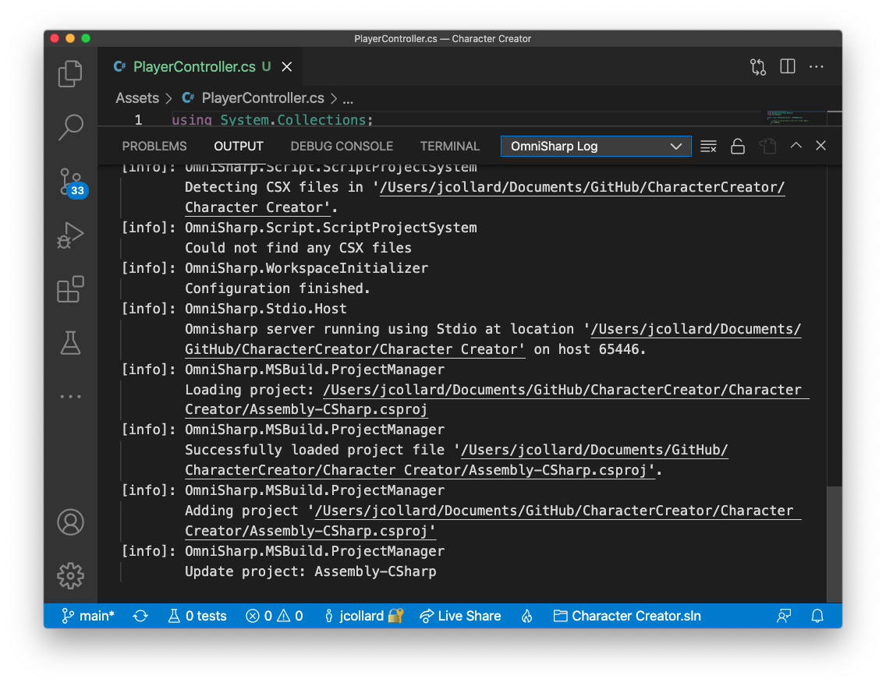

Another way to test that things are working is to check that autocomplete is
functioning properly.

In the `Start()` method that was generated, you should be able to type `this.tr`
and it should show an autocompletion for `this.transform`. This means that Unity
is communicating with VS Code.

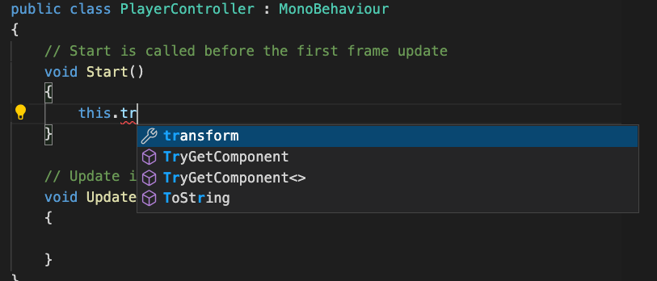

If you are ever not seeing errors in VS Code **or** your autocomplete isn't working properly. You should be able to fix this by completely exiting VS Code from the task bar and relaunching from inside Unity. 

## Commit your Work

Whew! That was a lot of work to get our project set up. Let's save that progress.

1. Add all of the changes to the project
2. Commit. Your message should be something like `chore: Initialize project.`
3. Push your changes
4. Add a tag called `getting-started`
5. Push your tag