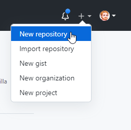
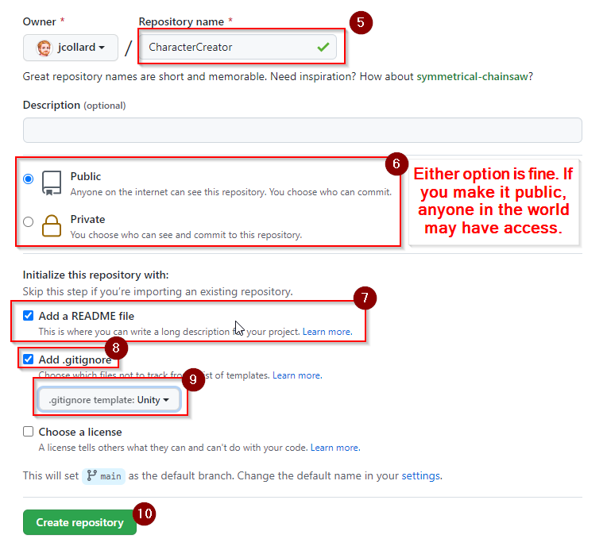

# Character Creator

For this project, you will create a basic Character Creation tool where a player can select the weapon and armor their character is using.

## Create a new Repository

1. Go to GitHub.com
2. Login
3. In the top right corner, click the `+` icon.
4. Select `New Repository`

5. Set the name of your repository to `CharacterCreator`
6. Select `public` or `private`. If you select `public` the repository will be accessible by anyone in the world.
7. Check that you want to create a `README` file
8. Check `Add .gitignore`
9. Select `Unity` as the `.gitignore template`
10. Click `Create repository`

## Setup a Unity Project

1. Clone your repository using GitHub Desktop.
2. 
